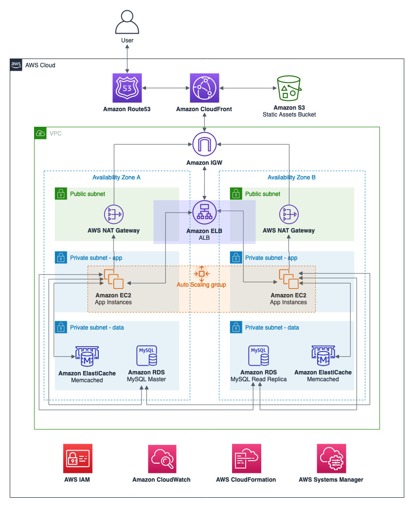

## AWS AutoScaling PHP App Demo

The purpose of this demo is show how to use some AWS services to create a scalable architecture. We are going to create a web app architecture and do a load test.

The architecture above shows a VPC separating the subnets in public and private subnets, a high scalable application layer utilizing AutoScaling and a high scalable data layer with managed cache service **(Amazon ElastiCache)** to store sessions and managed relational database service **(Amazon RDS)** with replicas to scale reads. Also, we are storing static assets in a bucket **(Amazon S3)** and utilizing a CDN **(Amazon CloudFront)** to deliver the static assets and minimize latency to deliver dynamic content.

To test the application architecture we are utilizing the tool **Locust**, an open source load testing tool, to simulate users acessing our workload.

## CloudFormation

## Clean up

## Reference links
* Locust: https://docs.locust.io/en/stable/
* Scaling up to your first 10 million users: https://www.youtube.com/watch?v=Ma3xWDXTxRg

## License summary
This sample code is made available under the MIT-0 license. See the LICENSE file.